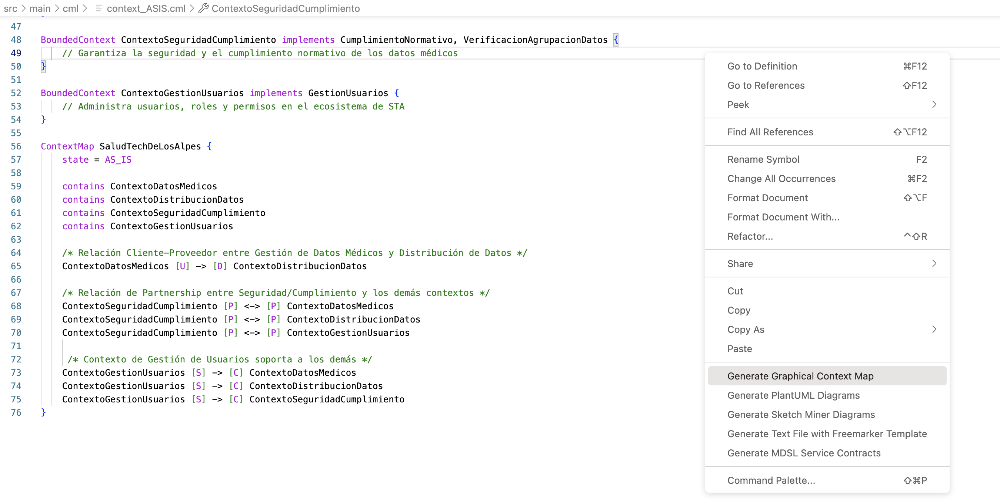
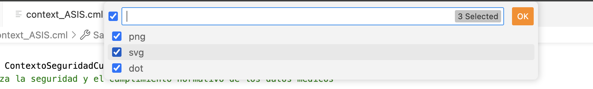
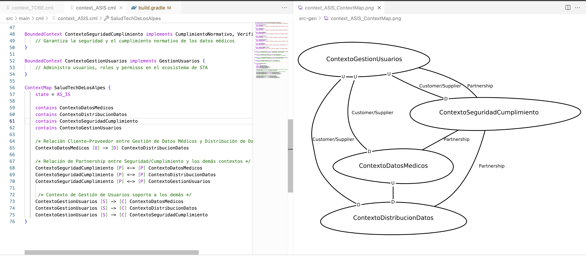

# Scalable Minds Project

## Estructura del Proyecto

El proyecto está organizado de la siguiente manera:

En la ruta src/main/cml podrás encontrar los siguientes archivos:

- domain_subdomain_ASIS.cml: Encontraras el dominio principal del proyecto y los subdominios identificados, cada uno con su Vision Statement.
- context_ASIS.cml.cml: Encontraras los contextos acotados del ASIS del proyecto, su relación con los subdominios identificados y la relación entre los contextos.
- domain_subdomain_TOBE.cml: Encontraras el dominio principal del proyecto y los subdominios identificados, cada uno con su Vision Statement.
- context_TOBE.cml.cml: Encontraras los contextos acotados del TOBE del proyecto, su relación con los subdominios identificados y la relación entre los contextos.

En la raíz del proyecto también encontraras el archivo .gitpod.yml con el cual puedes ejecutar el proyecto en Gitpod (https://gitpod.io/).

## Ejecutar el Proyecto

Para ejecutar el proyecto en Gitpod, sigue los siguientes pasos:

1. Abre el proyecto en Gitpod (https://gitpod.io/) utilizando el siguiente archivo:

```bash
.gitpod.yml
```

2. Abre el archivo del cual deseas visualizar el modelo CML, por ejemplo:

```bash
src/main/cml/context_ASIS.cml
```

3. Haz click derecho sobre el contenido del archivo y selecciona la opción "Generate Graphical Context Map":



4. Te pedirá que selecciones el tipo de archivo que deseas generar, selecciona "png" para visualizar el modelo CML en una imagen:



5. Se abrirá una nueva pestaña en tu VS Code con el modelo CML generado:



6. En la ruta src-gen encontraras el archivo generado con el modelo CML en los formatos seleccionados.


## Event Storming

En la ruta src/main/event_storming podrás encontrar los siguientes archivos:
    
    - Lenguaje Ubicuo AS-IS.jpg: Encontraras el Lenguaje Ubicuo del proyecto en su estado actual.
    - Lenguaje Ubicuo TO-BE - Automatizacion y expansion global.jpg: Encontraras el Lenguaje Ubicuo del proyecto en su estado futuro.